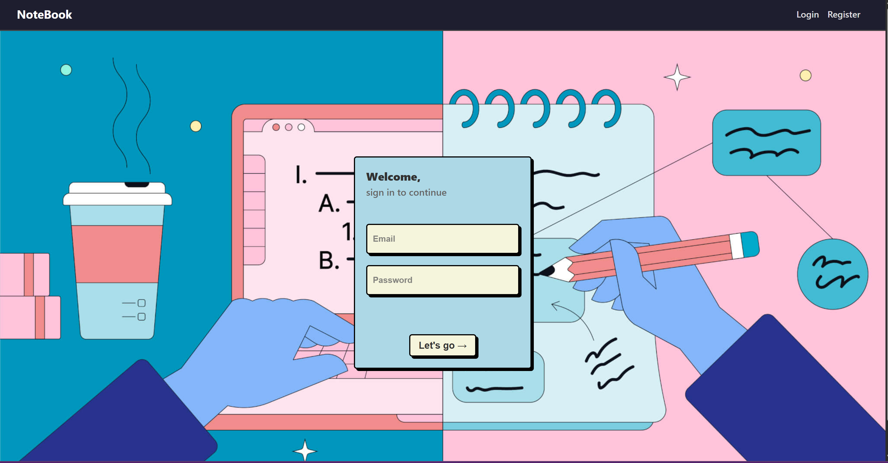
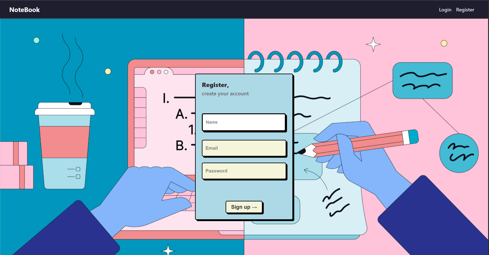
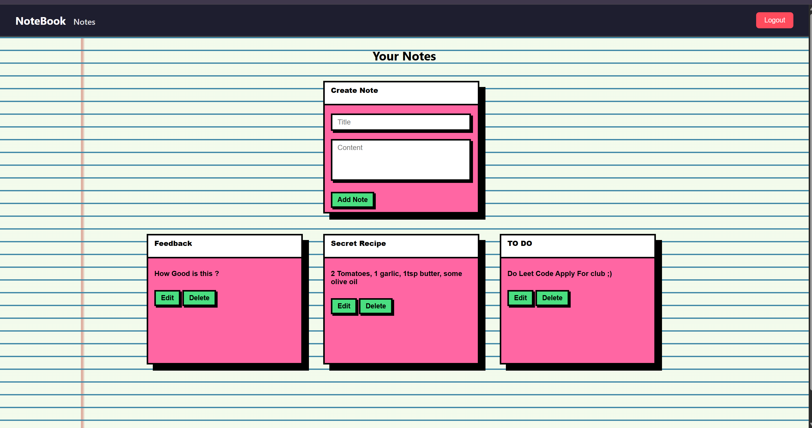

# 📒 NoteBook App (MERN Stack)

A full-stack **Note Taking Application** built with the **MERN stack** (MongoDB, Express, React, Node.js). Includes user authentication and full CRUD functionality for notes.

---

## 🚀 Features

- User Registration & Login with JWT authentication
- Create, Read, Update, and Delete (CRUD) personal notes
- Protected routes & authorization
- Responsive UI using React
- Backend API using Express and MongoDB

---

## 🧱 Tech Stack

**Frontend**
- React
- Axios
- React Router

**Backend**
- Node.js
- Express
- MongoDB & Mongoose
- JWT (JSON Web Tokens)
- bcryptjs
- dotenv
- cors

---

## 🔧 Setup Instructions

### 1. Clone the Repository

```bash
git clone https://github.com/Abhi378-2005/Notebook-using-Mern.git
cd Notebook-using-Mern
```

2. Backend Setup
```bash
cd Backend
npm install
```

✏️ Create a .env file in root of backend if not present and add your monogodb Connection Details

```env
MONGO_URI=mongodb://localhost:27017/Notebook
JWT_SECRET=your_jwt_secret
PORT=5000
```
Start the backend
```bash
npm run server
```

4. Frontend Setup
Open another terminal:
```bash
cd notebook-frontend
npm install
```
Start the frontend
```bash
npm start
```
🌐 Folder Structure

```css
notebook-app-mern/
├── Backend/
│   ├── models/
│   ├── routes/
│   ├── controllers/
│   ├── middleware/
│   ├── .env
│   └── server.js
├── notebook-frontend/
│   ├── src/
│   │   ├── pages/
│   │   ├── components/
│   │   ├── utils/
│   │   └── App.js
├── README.md
```

🛠 API Endpoints
```
Auth
POST /api/auth/register — Register new user

POST /api/auth/login — Login user (returns JWT token)

Notes
GET /api/notes — Get all user notes (requires token)

POST /api/notes — Create a note

PUT /api/notes/:id — Update a note

DELETE /api/notes/:id — Delete a note
```
⚠️ All /api/notes routes require a valid Authorization: Bearer <token> header.

## 📸 Screenshots


### Home Page


### Login Page




### Register Page




### Notes Page




📄 License
This project is open source and free to use under the MIT License.

## 🙌 Author

Made with 💻 by Abhi378-2005 {Abhishek Paithankar} 😎
